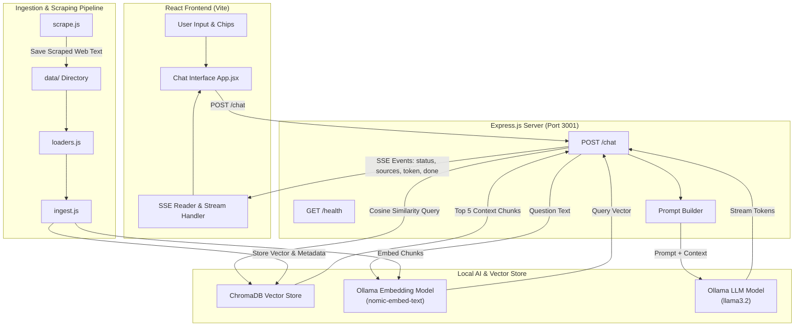

# 🕌 Dar Chaaben RAG System — Complete Project Documentation

A **100% Local, Privacy-First Retrieval-Augmented Generation (RAG) System** designed to answer user queries about **Dar Chaaben El Fehri** (دار شعبان الفهري), a coastal town in the Nabeul Governorate, Tunisia.

This project combines an **Express.js backend**, a **Vite + React frontend**, **ChromaDB vector database**, and local AI models running via **Ollama** (`nomic-embed-text` for semantic embeddings and `llama3.2` / `llama3` for language generation).

---

## 📐 System Architecture



---

## 📁 Repository Structure

```
rags/
├── backend/
│   ├── main.js             # Express server with SSE streaming & RAG endpoint
│   ├── ingest.js           # Multi-format document chunking & vector indexing pipeline
│   ├── loaders.js          # File loaders for PDF, DOCX, TXT, MD, and JSON formats
│   ├── scrape.js           # Web scraper using Cheerio to extract article content
│   ├── DOCUMENTATION.md    # Detailed backend function reference
│   ├── package.json        # Backend scripts and dependencies
│   └── package-lock.json
│
├── frontend/
│   ├── src/
│   │   ├── App.jsx         # Main React Chat UI component (SSE, Sources panel, Chips)
│   │   ├── main.jsx        # React root entry point
│   │   ├── index.css       # Premium CSS styling system (Dark glassmorphism theme)
│   │   └── style.css       # Auxiliary styles
│   ├── public/             # Static web assets
│   ├── index.html          # HTML page entry
│   ├── vite.config.js      # Vite build setup
│   └── package.json        # Frontend scripts and dependencies
│
├── data/                   # Raw Knowledge Base files (.txt, .md, .pdf, .docx, .json)
│   ├── dar-chaabben.txt
│   └── web_*.txt           # Scraped text documents
│
├── chroma/                 # ChromaDB vector store persistent storage directory
└── PROJECT_OVERVIEW.md     # This comprehensive project documentation
```

---

## 🛠️ Technology Stack

| Layer | Technology | Role |
|---|---|---|
| **Frontend UI** | React 19, Vite, Vanilla CSS | Responsive dark-mode interface, real-time SSE token streaming renderer, collapsible source cards |
| **Backend API** | Node.js, Express 4, CORS | REST API endpoint (`/chat`) providing Server-Sent Events (SSE) streaming |
| **Document Processing** | `pdf-parse`, `mammoth`, `cheerio` | Multi-format loader (`.pdf`, `.docx`, `.txt`, `.md`, `.json`) and web scraper |
| **Vector Database** | ChromaDB (`chromadb` SDK) | Local vector database using Cosine Similarity (`hnsw:space: cosine`) |
| **Embeddings AI** | Ollama (`nomic-embed-text`) | Local 768-dimensional text embeddings generation |
| **LLM Inference** | Ollama (`llama3.2` / `llama3`) | Local text generation model with streaming token response |

---

## ⚡ Core Features & Capabilities

1. **100% Local & Private**: Runs completely on local hardware without sending data to third-party cloud APIs.
2. **Server-Sent Events (SSE) Streaming**: Responses are generated and streamed token-by-token directly to the user's interface.
3. **Transparent Source Citation**: Every answer displays the exact knowledge chunks retrieved from ChromaDB, along with relevance scores (`1 - distance`).
4. **Multi-Format Ingestion**: Supports `.txt`, `.pdf`, `.docx`, `.md`, and `.json` documents out of the box.
5. **Built-in Web Scraper**: Command-line utility to scrape clean article text from URLs and automatically save them for indexing.
6. **Multilingual System Prompt**: Instructed to respond in Arabic, English, or French based on the user's language.

---

## 🔄 End-to-End Data & Execution Flow

### 1. Knowledge Base Ingestion Flow
```
Raw Files (data/) ──> loadAllDocumentsFromDir() ──> Smart Chunking (400 chars, sentence boundaries) 
                  ──> Ollama /api/embeddings ──> ChromaDB collection ("dar_chaaben")
```
1. **Load**: `loaders.js` parses documents from `data/` regardless of format.
2. **Chunk**: `ingest.js` splits text into ~400 character chunks with 80-character overlap, respecting sentence boundaries (`. `, `\n`).
3. **Embed**: Sends each chunk to Ollama (`nomic-embed-text`) to create dense vector representations.
4. **Index**: Upserts vector embeddings, chunk text, and metadata (`source`, `fileType`, `chunkIndex`) into ChromaDB.

### 2. Live Chat Pipeline (`POST /chat`)
```
User Query ──> Embed Query ──> Retrieve Top 5 Chunks (ChromaDB) ──> Build RAG Prompt ──> Stream Response (LLM)
```
1. Frontend posts question to `/chat`.
2. Backend generates query embedding via `nomic-embed-text`.
3. ChromaDB performs vector search to find the top $K=5$ closest document chunks.
4. `sources` event is pushed via SSE to update the UI with reference citations.
5. Full prompt (System Rules + Knowledge Chunks + User Question) is sent to `llama3.2`.
6. Tokens are streamed real-time via SSE (`type: "token"`) and rendered live on screen.

---

## 📡 API Reference

### `GET /health`
Returns the status of the server and configured AI models.

- **Response**:
```json
{
  "status": "ok",
  "model": "llama3.2",
  "embed": "nomic-embed-text"
}
```

---

### `POST /chat`
Executes the RAG pipeline and streams responses using **Server-Sent Events (SSE)**. Supports conversational memory history.

- **Request Body**:
```json
{
  "question": "What is my name?",
  "history": [
    { "role": "user", "content": "My name is Khairi." },
    { "role": "assistant", "content": "Hello Khairi! How can I help you today?" }
  ]
}
```

- **SSE Event Types**:

| Event Type | Payload Example | Description |
|---|---|---|
| `status` | `{"type":"status", "message":"Searching knowledge base..."}` | Processing phase update |
| `sources` | `{"type":"sources", "sources":[{"text":"...", "score":"0.852"}]}` | Top retrieved source context |
| `token` | `{"type":"token", "token":"Dar "}` | Individual token chunk from LLM |
| `done` | `{"type":"done", "message":"Stream complete"}` | Signals completion of stream |
| `error` | `{"type":"error", "message":"Error message details"}` | Pushed if an exception occurs |

---

## 💻 Setup & Run Instructions

### Prerequisites
1. [Node.js](https://nodejs.org/) (v18+ recommended)
2. [Ollama](https://ollama.com/) installed and running locally
3. Pull required Ollama models:
   ```bash
   ollama pull nomic-embed-text
   ollama pull llama3.2
   ```

---

### 1. Ingest Data into ChromaDB
Place your data files into `data/` or scrape web content, then run:

```bash
cd backend
npm run ingest
```

To scrape a web page:
```bash
cd backend
node scrape.js https://en.wikipedia.org/wiki/Dar_Chaabane
npm run ingest
```

---

### 2. Start the Backend Server
```bash
cd backend
npm run start
```
*The backend server will run on `http://localhost:3001`.*

---

### 3. Start the Frontend Application
In a new terminal:

```bash
cd frontend
npm run dev
```
*Access the web application at `http://localhost:5173`.*

---

## 🔍 Codebase Component Deep-Dive

### Backend (`/backend`)
- [main.js](file:///d:/rags/backend/main.js): Serves Express application, configures SSE response headers, embeds input questions, interfaces with ChromaDB, formats context prompts, and reads Ollama's readable stream.
- [ingest.js](file:///d:/rags/backend/ingest.js): Orchestrates knowledge ingestion, clears and creates ChromaDB collections, handles chunking mathematics, and persists document metadata.
- [loaders.js](file:///d:/rags/backend/loaders.js): Standardizes text extraction across PDF (`pdf-parse`), Word (`mammoth`), JSON, Markdown, and TXT files.
- [scrape.js](file:///d:/rags/backend/scrape.js): Utilizes Cheerio to strip boilerplate elements (`nav`, `footer`, `ads`, `scripts`) and extract primary article content into `data/`.

### Frontend (`/frontend`)
- [App.jsx](file:///d:/rags/frontend/src/App.jsx): Main application state coordinator managing messages array, streaming status, SSE event listener loop, suggested topic chips, auto-resizing input textarea, and auto-scrolling view.
- [index.css](file:///d:/rags/frontend/src/index.css): Responsive styling sheet with custom scrollbars, CSS keyframe animations, glassmorphism overlays, and mobile-ready layouts.

---

## 🔐 Configuration Parameters

| Parameter | Location | Default Value | Description |
|---|---|---|---|
| `PORT` | `backend/main.js` | `3001` | HTTP Port for backend server |
| `OLLAMA_BASE_URL` | `backend/main.js`, `ingest.js` | `http://localhost:11434` | Ollama local endpoint |
| `EMBED_MODEL` | `backend/main.js`, `ingest.js` | `nomic-embed-text` | Vector embedding model |
| `CHAT_MODEL` | `backend/main.js` | `llama3.2` | Language model for chat answers |
| `COLLECTION_NAME` | `backend/main.js`, `ingest.js` | `dar_chaaben` | ChromaDB collection identifier |
| `TOP_K` | `backend/main.js` | `5` | Number of context chunks retrieved |
| `CHUNK_SIZE` | `backend/ingest.js` | `400` | Target length of text chunks (chars) |
| `CHUNK_OVERLAP` | `backend/ingest.js` | `80` | Overlap length between chunks (chars) |
